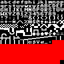

# 003 VGA Planning

The graphics card will be heavily inspired by Debug Innovations' TTL VGA Terminal, as well as Ben Eater's graphics card. I will support both a text and a graphics mode. The card will require DMA of the main system memory, as it will not have its own VRAM. The framebuffer will live in the Fixed RAM region, meaning that at most the framebuffer can be 39.75K in size. Of course, a framebuffer of this size would not be ideal as it leaves little to no fixed RAM for program usage, and relying heavily on Banked RAM sounds prime for a headache. Instead, it will live in the 100 and 101 MSB regions, for a maximum size of 16K. The card will support only a single VGA standard - 640 x 480 @ 60 Hz.

## Text Mode

In text mode, the display will be divided into 8x8 character regions, meaning a full frame may contain 80 columns and 60 rows of text. The contents of each cell will be described via 2 bytes in the framebuffer. The first byte contains a character code describing which character should be drawn in the cell. The second bytes contains a format code, which describes how the character should be drawn in the cell. The character font will be stored on the graphics card in either a ROM or a RAM. I may decide to use a RAM so that new characters can be loaded to the card via the computer during operation, but ROM would certainly be easier to design for. Essentially, each character is an 8x8 bit map, which will be accessed from the font memory via the character code in the first frame buffer byte. The manner in which the 1s and 0s are drawn on the display will be configurable on a per-cell basis via the second byte format code, which will have the following form:

    0  1  2  3  4  5  6 7
    Rf Gf Bf Rf Gf Bf U R

Where the first 3 bits describe the color of the foreground (the 1s) and the second 3 bits describe the color of the background (the 0s). With 1 bit per RGB channel, there are 8 colors available to select from. These are shown below.

Bit 6 describes whether this character should be underlined, and bit 7 describes whether the character should be color reversed. These can be used in any combination together.

With 8-bit character codes, 256-character font sets can be developed. Below is my "custom" font set, which is based on the Commodore's PETSCII character set. Some characters have been added, and others have been removed to make it better fit my purposes. Some characters have had their designs tweaked slightly. The red cells represent unused regions. It may be that some may need to be used as control codes, but I'm hoping to avoid that - I'd like this to represent 256 visible characters, specifically.

Below is an example of what the 8 color fg and bg variations may look like. Note that the font used here is an older 8x16 font that I developed and then abandoned in favor of an 8x8 one. However, the colors are the same.

## Graphics Mode

Graphics mode will use a single byte per cell to describe it's color. This gives a palette of 256 colors, shown below.

Cells will be 5x4 pixels in size, meaning the effective resolution will be 128x120. Below is an example of what
graphics mode output would look like.

Obviously its nothing amazing, but when I began to think about this card, I initially was planning to settle for only a text mode. This graphics mode comes at the expense of more hardware, but fits in the same frame buffer allocated region.

## Space Usage

Text Mode actually only occupies 80x60x2 = 9600B of the 16KB frame buffer region, or 59%. This means there is plenty of space in the 100 and 101 MSB regions for other usage, if the programmer knows where to look. Similarly, Graphics Mode will occupie 128x120 = 15KB of the region, or 94%. So again, there is some unused space in this region that can be employed by the programmer. The VGA card will only access the 100 and 101 MSB regions, though.

## Hardware Design

A fair amount of this hardware has been designed in different components, but it has not been integrated, built, or tested in any capacity. A new post will be made once hardware development is further along to describe how all of this will be accomplished.