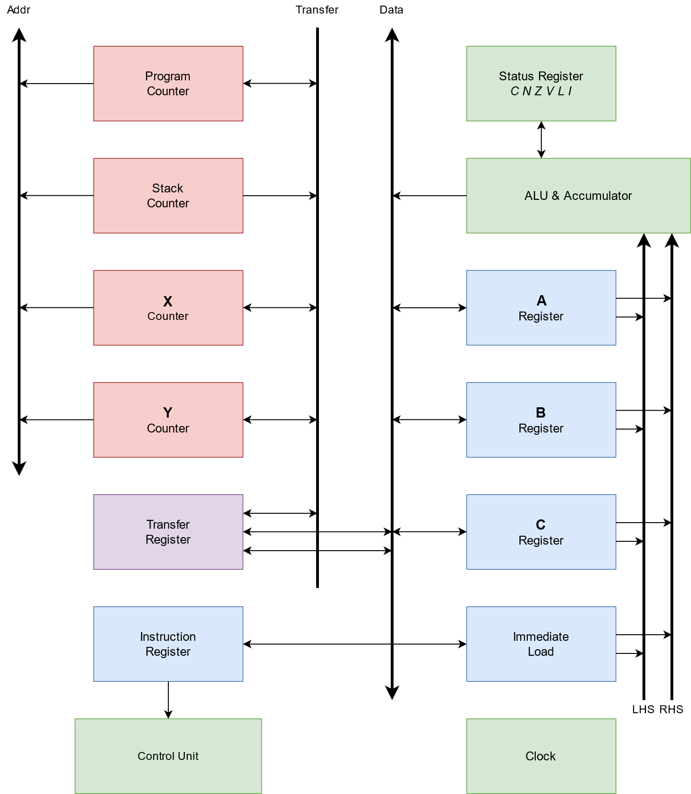

# 004 Design Update

I've been working on the CPU architecture design in my spare time. The problem that arose with my previous design, was that there was not enough opcodes to fully support the 4 GPRs. There was also not as many ALU operations as I'd like to have supported. So I revisited the architecture, removed a GPR, added some additional buses, and upgraded my ALU. The instruction set is not fully fleshed out yet (more to come later), but I'm confident that with this design I can have a robust 8-bit CPU design that isn't a nightmare to program for.

Here is a diagram of the new architecture:

Here are some things to note:

1. There are now only 3 GPRs: A, B, C. They fully support all ALU operations and other MOV instructions in the ISA.

2. The ALU (internals still need to be designed) is now much more capable.

3. The ALU contains two input buses: LHS and RHS. These are 8-bit buses which can pull values from any of the 3 GPRs, or directly from the data bus. This will reduce every two-operand ALU instruction cycle length by 1 cycle, probably.

4. The data bus can be directly fed into LHS or RHS via the Immediate Load latches. This allows for ALU operands to come from memory as an "Immediate" value, or from a 16 bit counter register.

5. The 16 bit registers are now "Counter Registers," meaning they are capable of in-place incrementing and decrementing, like the Program Counter and the Stack Counter.

6. The 16 bit registers can directly assert to the address bus, removing the need for a dedicated Memory Address Register (MAR)

7. 16 bit Counter Registers can swap values via the 16 bit Transfer Bus (TXBUS)

8. 16 bit values can be moved to 8 bit GPRs via the Transfer Register, which presents as a 16 bit register on the TXBUS, and 2 8 bit registers on the data bus (DBUS).

9. There are new flags in the status register: L and I. These represent Logical Carry and Interrupt Inhibit, respectively.

I have also ordered some parts that I think will be useful in building the GPRs. As previously mentioned, the ALU still needs to be fleshed out. However, I think the 8 bit registers and the 16 bit counter registers are close to being ready for building. Plus I want to jump to actually building some things.

Registers A, B, C will be constructed via 2 74LS173 chips, which are 4-bit D flip-flop chips. These were selected rather than a single octal D flip-flop chip due to the inclusion of input enable, output enable, clock, and clear lines. I figure that an additional chip is worth it for easier design and control. Each bus will be driven with the 74LS245, which is an octal bus transceiver. In the cases were a register only needs to assert to or load from a bus (as is the case with the GPRs and the LHS/RHS buses), this chip is slightly overkill. But as it happens, the 74LS541 are more expensive than the 245s. So, I decided to order all 245s for bus driving.

So then, each GPR will be constructed:

- 1x 10-segment bargraph LED display (8-segment are uncommon, unfortunately)
- 2x 74LS173 4-bit D flip flop
- 3x 74LS245 octal transceivers for bus control

The Instruction Register can be constructed in a similar fashion, except that only 2x 74LS245 are needed. This is to drive its output to the Control Unit. Its unclear yet whether we need output control here; it might be that always on output is okay. If that is okay, then only one 245 will be needed.

Potentially, the Status Register will be able to be built in a similar fashion as the GPRs. However, ALU design needs to be further along for me to say that with confidence.

The Immediate Load unit, I think, will only need:

- 2x 74LS245 octal transceivers for LHS and RHS bus control
