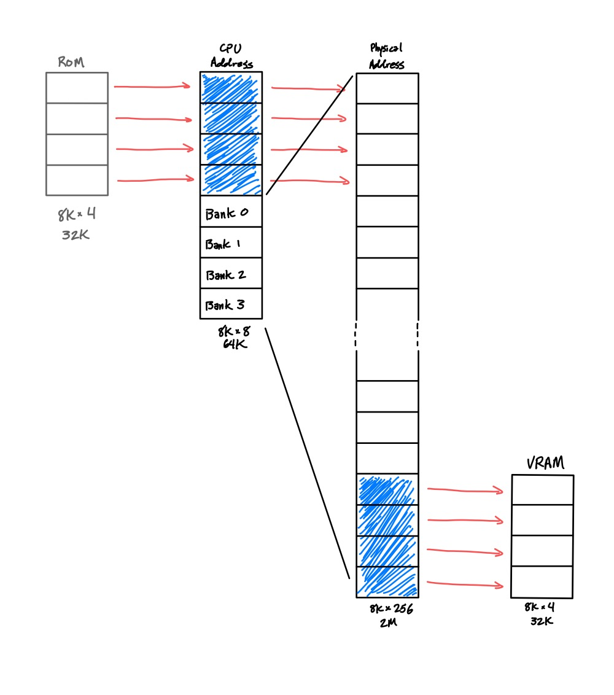

# 🗺 Memory Map

The memory map was designed to maximize contiguous RAM space and provide ample banking to work around the 64 KB addressing limitation imposed by the 16-bit address bus.

    $E000 - $FFFF:   Banked RAM (8K)
    $C000 - $DFFF:   Banked RAM (8K)
    $A000 - $BFFF:   Banked RAM (8K)
    $8000 - $9FFF:   Banked RAM (8K)
    $0100 - $7FFF:   Fixed RAM (31.75K)
    $0000 - $00FF:   MMIO (256B)

This memory map provides just-shy of 32 KB of contiguous fixed RAM, and then another 32 KB of contiguous banked RAM in the form of 4x 8 KB banked regions. The first page of memory is allocated to memory mapped IO, the only form of IO in the system. Specifications of the active page for each bank will be done via 4x 1-byte registers in the MMIO region. This region will be divided into 16 equally sized IO ports, each afforded 16 IO registers. Here is a potential utilization scheme for the IO ports:

1. Programmable Interrupt Controller 1 (PIC)
2. Programmable Interrupt Controller 2
3. Memory Mapping Unit (MMU)
4. [UART](uart.md)
5. [SPI Bus](spi.md)
6. [Video Card](video-card.md)
7. [Sound Card](sound-card.md)
8. Sound Card 2
9. DMA Controller
10. PS/2 Keyboard Controller
...

Note that these IO devices largely correspond to those mentioned in the [readme](../readme.md). The new comers are the PIC and the MMU. The PIC is responsible for coalescing interrupts from multiple sources into a single IRQ input for the CPU. It contains registers for specifying the addresses of unique ISRs for each interrupt source. When the CPU reads from its ISR Vector, the PIC is responsible for making the highest-priority, non-masked, active interrupt's ISR address available at the vector location. The MMU contains registers used to configure the active page in each bankable location, as described above.

Note that the Sound Card and the PIC each use 2 IO ports a piece - this is due to the number of expected registers each device will require. I've elected to keep the number of registers per IO port relatively small, as doing so allows for devices which do in fact only need a few registers to be integrated in a less wasteful manner.

Another useful aspect of this memory configuration is that nearly the entire address space is covered by RAM, rather than ROM. This allows greater flexibility and usage of the address space, as all regions will allow writes. In order to facilitate this, a sub circuit will hold the CPU in reset while a ROM is copied into RAM. At runtime, this ROM becomes inactive. The copier circuit will initialize the entire low 32 KB of the address space, which has the side effect that the ROM can be used to initialize writable IO registers are pre-runtime.

The initial location of the DP and the SP are specified by the state of Constant Generators internal to the CPU. These are configurable via DIP switches on the appropriate CG boards. However, both values can be modified at runtime, should the user decide to relocate the stack or direct page. This can be done with the appropriate MOV opcodes made available in the Instruction Set.

The bank select registers will use all 8-bits to select a region of physical RAM to map into the bank regions. As the regions are 8 KB in size, this gives 2^8 * 8 KB = 2 MB of physical RAM accessible to the system. In fact, even the low 31.75 KB of RAM will map into this physical space.

If the decoded address belongs to the highest 32 KB of the physical RAM, then any writes will also be pushed through to VRAM. Effectively, this region shadows VRAM. It allows for any of the four banks to be used for VRAM manipulation, and it removes all potential contention issues for VRAM reads.

Both this, as well as the ROM copy-on-reset, are examples of RAM shadowing. The shadow regions are shown in blue, below.

