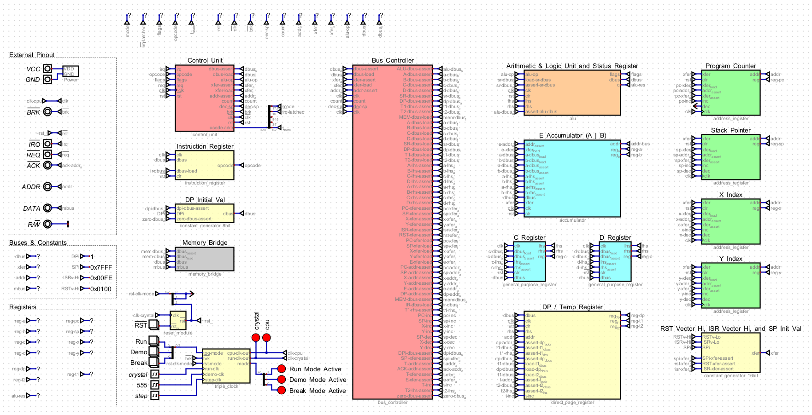

# 👾 BW8cpu

The BW8cpu is a homemade CPU built with discrete TTL logic chips on custom PCBs. It has a target clock rate of approximately 6 MHz, and is comparable to the Motorola 6809, and more specifically the Hitachi 6309, with its dual accumulators and additional dual general purpose registers.

A larger computer system is built around the CPU in the form of a full peripheral suite that allows the BW8cpu to function as a machine similar to the Commodore 64, Apple II, or NES. From a hardware perspective, the BW8cpu matches or maybe exceeds these systems in capability and usability in many regards. Its my hope that the system will eventually exceed its predecessors from a software perspective as well.

The project is originally inspired by Ben Eater's [8-bit breadboard CPU](https://eater.net/8bit) and his [breadboard MOS 6502 computer](https://eater.net/6502). However, ultimately the micro-architecture takes more cues from James Sharman's [8-bit pipelined CPU](https://www.youtube.com/watch?v=3iHag4k4yEg&list=PLFhc0MFC8MiCDOh3cGFji3qQfXziB9yOw). This project would not be possible without the support of many individuals present on James' Discord server, notably [rj45](https://github.com/rj45/rj32), Quandary, Artentus, and [Louis Jewett](https://www.youtube.com/channel/UCsxBT-Jh5pMDU-uEN_EUXtg/featured).

This project is extremely ambitious and long running. This repository will maintain documentation and descriptions of the existent and planned features, as well as supporting schematics and source code files.

## Features

- 8-bit CPU with 16-bit addressing
- Up to 512 opcodes across 50+ instructions (CISC ISA)
- Dual 8-bit accumulators (A, B) accessible also as one 16-bit accumulator (E)
- Two additional 8-bit General Purpose Registers (C, D)
- Full 16-bit Stack Pointer (SP) and Program Counters (PC)
- Configurable Direct Page addressing (movable Zero Page)
- Two 16-bit Index Registers (X, Y)
- 32-function ALU with 4 flags (Carry, Zero, Overflow, Sign)
- Single IRQ source
- Partially configurable hardware memory map

## Architecture Overview

- [von Neumann architecture](https://en.wikipedia.org/wiki/Von_Neumann_architecture) with shared program and data address space
- Vertical microcode (heavily encoded) with 32-bit Control Bus
- Direct to address bus assertions without MAR
- No instruction pipelining - up to 8 clocks / instruction

## Expansion & Peripherals

- IO is memory mapped
- Reference Memory Map features:
    - 256 bytes IO space
    - 31.75 KB fixed RAM space
    - 32 KB total bankable space (4x 8 KB banks)
- Plans for full peripheral suite:
    - Programmable Interrupt Controller with 8 interrupt sources
    - VGA Video Card with output at 320x240 with 40x30 tilemap, hardware scrolling, and hardware sprite support
    - PS/2 keyboard input
    - Programmable Sound Generator with 4 voices
    - SPI Controller for SD card-based persistent storage
    - RS-232 UART networking interface
    - DMA Controller for fast block copies

## Tool Chain

- Simulation with [Digital](https://github.com/hneemann/Digital)
- Emulation with [Rust](https://www.rust-lang.org/)
- Schematics and PCB layout with [KiCAD](https://www.kicad.org/)
- Assembler with [customasm](https://github.com/hlorenzi/customasm)
- Microcode development with customasm
- High level programming with [MHL](https://github.com/Artentus/MHL)

## Explore

🔧 [ISA](docs/instruction-set-architecture.md)

🧮 [ALU](docs/arithmetic-logic-unit.md)

🚥 [CU](docs/control-unit.md)

📺 [VGA](docs/video-card.md)

💾 [SPI](docs/spi.md)

📢 [PSG](docs/sound-card.md)

📡 [UART](docs/uart.md)

🎛 [Emulator](docs/emulator.md)

🎯 [Simulator](docs/simulator.md)

🗺 [Memory Map](docs/memory-map.md)

🏗 [Assembler](docs/assembler.md)
